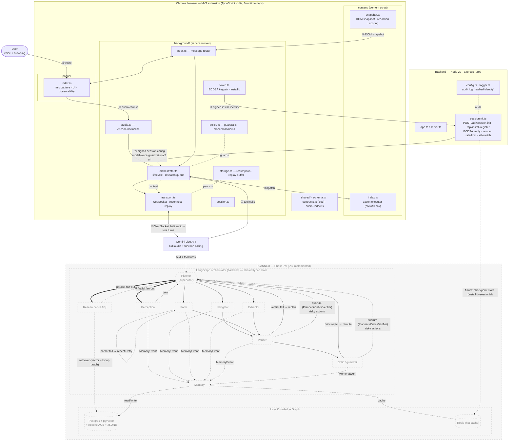

# Gemini Hackaton


Production-oriented monorepo scaffold for:
- a Manifest V3 TypeScript Chrome extension
- a TypeScript backend token service
- a LangGraph-based multi-agent orchestrator (backend) using LangChain primitives for tools, prompts, memory, and guardrails

## Architecture

Solid lines/boxes are implemented; the dashed, greyed-out block is the **Phase 7/8 roadmap (0% implemented)**. The numbers ①→⑦ trace the runtime sequence.



## Project goals

1. Ship a hardened MV3 Chrome extension that connects the browser to Gemini Live (realtime voice + tool-use).
2. Run a TypeScript backend that mints authenticated sessions (ECDSA install identity, nonce/replay protection, rate limits, kill switch) and serves signed session config (model, voice, guardrails, policyVersion, websocket URL).
3. Operate a **fully autonomous multi-agent system** on the backend via **LangGraph** — no human-in-the-loop. Safety enforced by agent quorum, verifier rollback, policy classification, and hard budget caps.
4. Specialized agents (each a subgraph with its own state, prompts, and tools):
   - **Planner** — decomposes user voice intent into a task DAG; owns long-horizon goal and replan decisions.
   - **Perception** — DOM snapshot, accessibility tree parse, screenshot OCR, semantic element tagging.
   - **Navigator** — routing, search, link traversal, multi-tab coordination.
   - **Form agent** — field detection, value generation, validation, submission.
   - **Extractor** — structured data scrape with schema-conforming output.
   - **Verifier** — checks post-action state vs expected; triggers replan/rollback on mismatch.
   - **Critic / guardrail** — policy enforcement with autonomous veto and reroute (no human prompt).
   - **Researcher** — RAG over docs/web for context the Live model lacks.
   - **Memory** — owns the user knowledge graph: episodic writeback, entity resolution, consolidation, decay, retrieval. See "User Knowledge Graph" below.
5. LangGraph composition:
   - Supervisor pattern: Planner routes between specialist subgraphs.
   - Shared typed state object flows through all nodes (DOM snapshot, task stack, scratchpad, verifier results).
   - Conditional edges for autonomous branching (verifier fail → replan, critic reject → reroute, parser fail → reflect+retry).
   - Parallel fan-out (Perception + Researcher concurrent, join at Planner).
   - Per-session checkpointing keyed by `installId` + sessionId on the same durable store used for nonce/rate-limit state — survives WS reconnects and enables time-travel debugging.
   - Node-level event streaming to the popup for observability (watch, not approve).
6. LangChain (JS) primitives shared across agents:
   - Uniform tool schemas for Gemini function calling (DOM read/click/fill, navigate, extract, fetch).
   - Prompt + output-parser templates versioned by `policyVersion`; auto-retry with reflection on malformed structured output.
   - Memory adapters: vector store (episodic), summary buffer (working), key-value (facts).
   - Retriever abstraction for Researcher RAG.
   - Multi-model routing: heavy reasoning on Gemini Pro, cheap classification on Flash — per-node tier choice.
   - Callbacks wired to existing hashed-identity audit log.
7. Autonomous safety substitutes for human gating:
   - Critic agent veto with structured rejection reasons.
   - Verifier-driven rollback (undo last action when post-state diverges).
   - Action blast-radius classification: high-risk actions require quorum (Planner + Critic + Verifier all approve) instead of human.
   - Hard budgets per session (max steps, max cost, max tool calls) terminate the graph.
   - Anomaly detector node (out-of-distribution DOM, unexpected redirects) → terminate + audit.
8. Keep the Gemini Live bidi **audio path native** — LangChain/LangGraph operate on text + tool-use turns only. Extension bundle stays free of LangChain deps; orchestration is backend-only.

## User Knowledge Graph (memory subsystem)

First-class subsystem owned by the Memory agent. Obsidian-style typed graph per user (`installId`-scoped), recording behavior, navigation, actions, entities, decisions, preferences, and learned skills.

### Memory layers (cognitive-inspired)

- **Sensory** — last N seconds of DOM diff + voice transcript. Ring buffer. Never persisted raw.
- **Working** — current session state inside the LangGraph shared state object.
- **Episodic** — events (what happened, where, when). Graph + vector dual-index.
- **Semantic** — distilled facts, preferences, entity properties. Confidence + provenance on every node.
- **Procedural** — reusable skills mined from repeated successful task DAGs. Stored as LangGraph subgraph templates the Planner can invoke.

### Node types

`Session`, `Intent`, `Task`, `Subtask`, `Action`, `PageVisit`, `Domain`, `Entity` (Person/Product/Order/Address/Account/Document/...), `Observation`, `Decision`, `Preference`, `Skill`, `Concept`, `TimeAnchor` (daily/weekly/monthly buckets), `Failure`.

### Edge types (directed, weighted, timestamped)

`PRECEDED_BY`, `CAUSED`, `REFERS_TO`, `BELONGS_TO`, `DERIVED_FROM` (provenance), `CONTRADICTS`, `REINFORCES`, `SIMILAR_TO` (vector-similarity, Obsidian "unlinked mentions"), `ABSTRACTS` (Concept ← Instance), `TRIGGERED_BY`, `SUPERSEDES` (versioned facts, history retained).

### Storage

Single transactional store:
- Postgres + `pgvector` (embeddings) + Apache AGE or recursive CTEs (graph traversal) + JSONB (typed node payloads).
- Redis hot cache for working memory and recent episodic.
- Per-`installId` namespace, row-level tenancy, no cross-tenant traversal at the query layer.

### Write path

- Agents do **not** write directly. They emit `MemoryEvent` via LangChain callbacks.
- Memory agent normalizes, deduplicates, runs entity extraction + embedding, resolves coreference, writes nodes + edges in one transaction.
- PII classifier gate before write: hash/redact credentials, payment fields, government IDs, etc.

### Consolidation (background jobs)

- **Episode compaction** — cluster raw events into summarized episodes; drop sensory residue.
- **Entity resolution** — merge duplicate entities across sessions; canonical names.
- **Concept formation** — embedding clusters become `Concept` nodes with `ABSTRACTS` edges.
- **Skill promotion** — task DAGs succeeding ≥ N times become `Skill` nodes; Planner reuses them.
- **Decay scoring** — `score = importance × recency × access_freq × confidence`. Below threshold → cold tier; long-cold → purge (per-node-type retention policy).
- **Contradiction resolution** — newer high-confidence fact emits `SUPERSEDES`; old node retained for audit.

### Read path — hybrid graph retrieval

- LangChain `Retriever` interface returns a **subgraph** (typed JSON), not flat docs.
- Pipeline: vector top-k seed → k-hop expansion along typed edges → re-rank by importance × recency × edge-weight path score → token-budgeted truncation.
- Per-agent retrieval profiles:
  - Planner: procedural + episodic.
  - Form agent: semantic preferences + entities.
  - Researcher: domain + concept.
  - Verifier: failure history + page-visit patterns.
  - Critic: failure + anti-pattern skills.

### Privacy and security

- Per-install isolation enforced at DB row level and query layer.
- Field-level encryption (AEAD) for sensitive payloads, key per install.
- TTL per node type (short for `PageVisit`, long for `Preference`).
- User endpoints: full export, cascading forget (by node / edge / domain / time-range), pause-recording.
- Every retrieval audited (agent id, query, returned node ids).
- No cross-install learning unless opt-in with differential privacy on aggregates.

### Popup UX (observability only)

- Obsidian-style graph view, filterable by node type / domain / time.
- Backlinks panel per node.
- Search with unlinked-mention suggestions.
- Manual pin / delete / edit (user is source of truth).

### Long-term payoffs

- Planner skips rediscovery via `Skill` matches.
- Form agent autofills from `Preference` graph instead of page heuristics.
- Researcher grounds Gemini answers in the user's own history.
- Verifier flags anomalies via `PageVisit` topology.
- Critic blocks known-bad patterns from `Failure` history.

## Workspace layout

- `packages/extension`: MV3 Chrome extension (background service worker, content script, popup)
- `packages/backend`: Node.js TypeScript token service scaffold

## Prerequisites

- Node.js 20+
- npm 10+

## Install

```bash
pnpm install
```

## Build all packages

```bash
pnpm -r build
```

## Build extension unpacked output

```bash
pnpm --filter @gemini-hackaton/extension build
```

Unpacked extension output is generated in:
- `packages/extension/dist`

Load it in Chrome:
1. Open `chrome://extensions`
2. Enable Developer mode
3. Click "Load unpacked"
4. Select `packages/extension/dist`

## Run backend in dev mode

```bash
pnpm --filter @gemini-hackaton/backend dev
```

## Placeholder quality scripts

```bash
pnpm -r lint
pnpm -r test
pnpm -r typecheck
```

## Configuration notes

- Update extension CSP `connect-src` endpoints in `packages/extension/public/manifest.json`
- Set backend env vars in `packages/backend/.env` (see `.env.example`)
- `SESSION_CREDENTIAL_SIGNING_SECRET` in `.env.example` is a dev placeholder; replace it before any shared deployment
- `SESSION_MINTING_ENABLED=false` provides an emergency stop switch for session issuance

## Operations

- Incident and emergency procedures: `docs/OPERATIONS_RUNBOOK.md`
- Pre-release validation gates: `docs/RELEASE_CHECKLIST.md`
